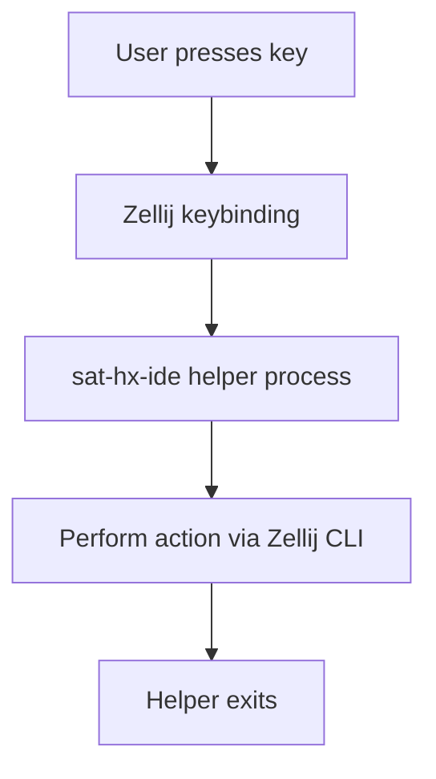
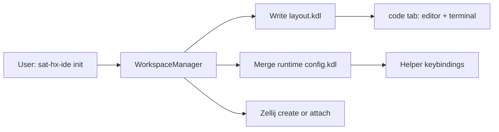
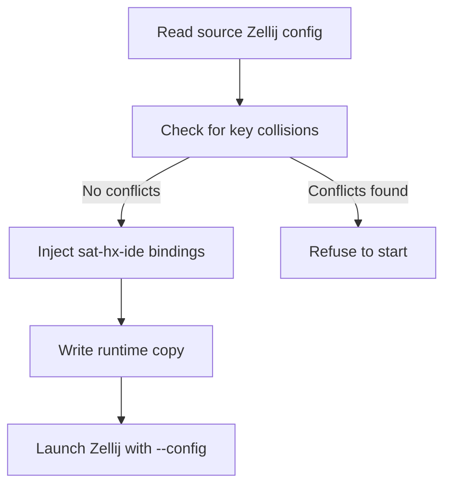

# Architecture & Design

This chapter provides a detailed look at the architecture and design decisions behind `sat-helix-ide`. It explains how the tool works under the hood, the process model, and the various components that make up the system.

## Process Model

`sat-helix-ide` follows a **short-lived process** model. Unlike traditional IDEs that run as long-running daemons, `sat-helix-ide` operates differently:

### No Background Daemon

- Each keybinding spawns a short-lived `sat-hx-ide` helper process
- The helper process drives Zellij CLI actions and exits immediately
- There is no persistent background process
- This design simplifies error handling and resource management

### Process Flow



This approach has several advantages:

1. **Reliability**: No daemon to crash or hang
2. **Simplicity**: Each action is isolated and self-contained
3. **Debuggability**: Easy to trace and debug individual actions
4. **Resource Efficiency**: No persistent memory usage when idle

## Session Initialization

The session initialization process sets up the complete Zellij workspace with all configured tools and layouts.

### Init Flow



### Step-by-Step Initialization

1. **Resolve Project Directory and Session Name**
   - Determine the project root from the provided path
   - Generate a session name based on the directory name
   - Allow override via `--session` flag

2. **Write `layout.kdl`**
   - Create the Zellij layout definition
   - Define the `code` tab with Helix and terminal
   - Optionally create the `ai` tab with the configured agent
   - Set up pane names and initial commands

3. **Merge Keybindings**
   - Read your existing Zellij config (read-only)
   - Check for key collisions with `sat-hx-ide` bindings
   - Inject `sat-hx-ide` bindings into a private runtime copy
   - Write the merged config to runtime directory

4. **Create or Attach Zellij Session**
   - Launch Zellij with `--config <runtime-copy>`
   - Either create a new session or attach to existing one
   - Pass all necessary environment and configuration

### Runtime Files

All runtime files are stored under:

```text
$XDG_RUNTIME_DIR/sat-helix-ide/<session>/
├── config.kdl          # Merged Zellij configuration
└── layout.kdl          # Session layout definition
```

**Fallback**: If `XDG_RUNTIME_DIR` is unavailable, the system temporary directory (`/tmp` on most systems) is used.

## Helper Commands

The core functionality of `sat-helix-ide` is implemented through **helper commands** that are invoked by Zellij keybindings.

### Command Structure

Zellij bindings invoke hidden subcommands on the `sat-hx-ide` binary:

| Key (default) | Command | Action |
|---------------|---------|--------|
| `Ctrl-y` | `__file-manager open` | Open/focus Yazi |
| `Alt-y` | `__file-manager toggle-dock` | Float or dock file manager |
| `Alt-t` | `__terminal toggle` | Hide/show terminal via fullscreen |
| `Alt-Shift-t` | `__terminal zoom` | Zoom terminal or dock back |
| `Alt-g` | `__git open` | Spawn configured Git TUI in floating pane |
| `Alt-r` | `__review open` | Spawn configured review tool in floating pane |
| `Alt-w` | `__workflow open` | Spawn configured workflow tool in floating pane |

### Helper Process Design

Helpers run in tiny floating panes with `close_on_exit true`, which means:

- Zellij keeps the keybinding helper's TTY for actions that need it
- The pane automatically closes when the helper exits
- The process is completely isolated from the main session

This design enables:
- File manager spawn (needs TTY for Yazi)
- Git TUI spawning
- Review tool execution
- Complex multi-step actions with proper cleanup

## Action Routing

All action logic is centralized in [`src/actions.rs`](https://github.com/vlevasseur073/sat-helix-ide/blob/main/src/actions.rs). The action router handles different types of requests and delegates to appropriate handlers.

### Action Types

The main action categories are:

1. **File Manager Actions**
   - Open: Create or focus file manager pane
   - Toggle Dock: Switch between floating and docked states
   - Handle file selection and opening in Helix

2. **Terminal Actions**
   - Toggle: Hide/show terminal via Zellij fullscreen
   - Zoom: Maximize terminal or restore docked size
   - Respawn: Create fresh terminal when previous one exits

3. **Git Actions**
   - Open: Spawn Git TUI in floating pane
   - Manage pane lifecycle

4. **Review Actions**
   - Open: Spawn review tool in floating pane
   - Handle various review workflows

5. **Workflow Actions**
   - Open: Spawn workflow tool in floating pane
   - Manage project management integrations

### File Manager Logic

```text
File Manager Open Logic:
If a `file-manager` pane exists:
    -> Focus it
Else:
    -> Rename the helper pane to `file-manager`
    -> Run Yazi in-process (chooser loop, open in Helix)
```

The integration uses Yazi's chooser loop to:
- Display the file selection interface
- Handle file selection
- Open selected files in the existing named Helix pane
- Manage pane focus and cleanup

### Terminal Logic

```text
Terminal Toggle Logic:
If terminal is visible:
    -> Apply fullscreen to editor/terminal panes
    -> Terminal stays alive but hidden
Else (terminal is hidden):
    -> Restore split layout
    -> Focus terminal pane

Terminal Respawn Logic:
If terminal pane was closed:
    -> Spawn fresh terminal with layout-aware direction
    -> Size against the editor pane
```

### Git Logic

Git integration is straightforward:

```text
Git Open Logic:
-> Spawn a floating pane on the code tab
-> Run the resolved Git client (lazygit/gitui) in the pane
-> Let the Git TUI manage its own lifecycle
```

### Review Logic

Similar to Git, but for review tools:

```text
Review Open Logic:
-> Spawn a floating pane on the code tab
-> Run the tool from `[tools.review]` (default: revdiff)
-> Handle diff viewing and navigation
```

## Pane Cache

To optimize performance and avoid repeated Zellij queries, `sat-helix-ide` implements a **pane cache** system.

### Cache Behavior

- **Cache Duration**: Within one helper invocation, `list-panes` results are cached for 500 ms
- **Cache Bypass**: Resize loops bypass the cache (`fetch_panes`) so geometry stays fresh
- **Invalidation**: Cache is invalidated after terminal respawn

### Why Caching Matters

Zellij CLI operations have some overhead. Without caching:
- Each action would query Zellij for the current pane layout
- Multi-step actions would make multiple queries
- Performance would degrade, especially with many panes

With caching:
- First query populates the cache
- Subsequent queries within 500ms use cached data
- Critical operations (like resize) get fresh data
- Overall responsiveness is significantly improved

### Cache Implementation

The cache is implemented as:
- A timestamp-based validity check
- Automatic invalidation on terminal respawn
- Manual bypass for resize operations
- Per-helper-process lifetime (no cross-process state)

## Terminal Layout

The `[terminal]` section in configuration controls the docked shell in the code tab.

### Configuration Options

```toml
[terminal]
enabled = true      # Include terminal pane in layout
dock_percent = 15   # Size as % of the split
dock_position = "down"  # "down" (horizontal) or "right" (vertical)
```

### Layout Behavior

**Horizontal Split (dock_position = "down"):**
```text
┌─────────────────────────────────────────┐
│                    Helix                  │
├─────────────────────────────────────────┤
│                Terminal                   │
│             (dock_percent %)              │
└─────────────────────────────────────────┘
```

**Vertical Split (dock_position = "right"):**
```text
┌───────────────────┬───────────────────┐
│                   │                   │
│      Helix        │    Terminal       │
│                   │  (dock_percent %) │
│                   │                   │
└───────────────────┴───────────────────┘
```

### Respawn Behavior

When the terminal needs to be respawning (e.g., after user exits the shell):

1. **Same Direction**: Uses the same split direction as configured
2. **Same Size**: Resizes against the editor pane to maintain proportions
3. **Fresh Process**: Spawns a new shell instance with `$SHELL`

## Configuration Merge

A critical design principle of `sat-helix-ide` is **non-intrusiveness**. The tool never modifies your global configurations.

### Merge Process



### Safety Features

1. **Read-Only Source**: Your global Zellij config is read but never modified
2. **Collision Detection**: All your existing keybindings are parsed and checked
3. **Private Runtime Copy**: Merged config is written to runtime directory only
4. **Zellij CLI**: Runtime config is passed via `--config` flag

### Keybinding Injection

`sat-helix-ide` bindings are injected under:

```kdl
shared_except "locked"
```

This means:
- Bindings are active in all Zellij modes except locked mode
- They don't interfere with your existing locked mode bindings
- They're available in normal, resize, pane, tab, and scroll modes

### Example Merge

**Source Zellij Config:**
```kdl
layout {
    pane split_direction="vertical" {
        pane
        pane
    }
}

keybind "Ctrl n" { action = NewPane; }
keybind "Ctrl q" { action = Quit; }
```

**Merged Runtime Config:**
```kdl
layout {
    pane split_direction="vertical" {
        pane
        pane
    }
}

keybind "Ctrl n" { action = NewPane; }
keybind "Ctrl q" { action = Quit; }

// sat-hx-ide bindings
shared_except "locked" {
    keybind "Ctrl y" { action = Run { command = "sat-hx-ide __file-manager open"; } }
    keybind "Alt y" { action = Run { command = "sat-hx-ide __file-manager toggle-dock"; } }
    keybind "Alt t" { action = Run { command = "sat-hx-ide __terminal toggle"; } }
    keybind "Alt Shift t" { action = Run { command = "sat-hx-ide __terminal zoom"; } }
    keybind "Alt g" { action = Run { command = "sat-hx-ide __git open"; } }
    keybind "Alt r" { action = Run { command = "sat-hx-ide __review open"; } }
    keybind "Alt w" { action = Run { command = "sat-hx-ide __workflow open"; } }
}
```

## Implementation Architecture

### Code Organization

The `sat-helix-ide` codebase is organized into several modules:

```text
src/
├── main.rs              # CLI entry point and command routing
├── actions.rs           # Action handlers and core logic
├── config.rs            # Configuration parsing and validation
├── layout.rs            # Zellij layout generation
└── error.rs             # Error types and handling
```

### Main Components

1. **CLI (main.rs)**
   - Uses `clap` for command-line argument parsing
   - Defines main commands: `init`, `doctor`, `config`, `version`
   - Routes to appropriate handlers

2. **Actions (actions.rs)**
   - Contains all helper command implementations
   - Manages Zellij pane operations
   - Handles file manager, terminal, Git, review, and workflow actions
   - Implements the pane cache system

3. **Configuration (config.rs)**
   - Parses TOML configuration files
   - Validates configuration values
   - Merges Zellij configurations
   - Handles default values and fallbacks

4. **Layout (layout.rs)**
   - Generates Zellij layout KDL
   - Creates editor, terminal, and AI panes
   - Manages layout templates and customization

### Error Handling

`sat-helix-ide` uses Rust's `anyhow` crate for comprehensive error handling:

- All functions return `Result<T, anyhow::Error>`
- Errors are context-rich with descriptive messages
- Configuration errors are caught early
- Runtime errors are properly propagated

## Design Decisions

### Why Zellij?

`sat-helix-ide` was built on Zellij because:

1. **Maturity**: Zellij is a stable, well-maintained terminal multiplexer
2. **Flexibility**: Excellent support for layouts, panes, and tabs
3. **Plugin System**: Support for custom keybindings and commands
4. **Cross-Platform**: Works on Linux, macOS, and Windows (WSL)
5. **Rust-based**: Written in Rust, matching the project's language

### Why Short-Lived Processes?

The short-lived process model was chosen over a daemon because:

1. **Simplicity**: No need to manage daemon lifecycle
2. **Isolation**: Each action is independent and stateless
3. **Reliability**: No risk of daemon crashes affecting the workspace
4. **Debuggability**: Easy to debug individual actions
5. **Resource Efficiency**: No persistent resource usage

### Why Non-Intrusive?

The non-intrusive design ensures:

1. **Safety**: Your existing configurations are never modified
2. **Compatibility**: Works with any Zellij, Helix, or tool configuration
3. **Reversibility**: Easy to uninstall or disable without side effects
4. **Trust**: Users can verify exactly what the tool does

## Performance Considerations

### Query Optimization

- **Pane Cache**: Reduces Zellij CLI calls during multi-step operations
- **Batched Operations**: Combines multiple actions when possible
- **Lazy Evaluation**: Only queries state when needed

### Memory Usage

- **No Daemon**: No persistent memory usage
- **Short Processes**: Each helper process has minimal memory footprint
- **Clean Exit**: Processes exit immediately after completing actions

### Startup Time

- **Parallel Setup**: Layout and config generation happens in parallel where possible
- **Lazy Loading**: Some resources are loaded only when needed
- **Caching**: Runtime files are cached across sessions

## Security Considerations

### Command Execution

- **Controlled Execution**: Only executes configured commands
- **Path Validation**: Validates executable paths before execution
- **Argument Sanitization**: Properly handles command arguments

### Configuration Safety

- **Read-Only**: Never writes to global configuration files
- **Validation**: Validates all configuration before use
- **Fallback**: Uses sensible defaults when configuration is missing

### Runtime Isolation

- **Per-Session State**: Runtime files are isolated per session
- **Temporary Files**: Runtime files are cleaned up automatically
- **No Persistent State**: No long-term state is maintained

## Future Architecture Directions

### Potential Improvements

1. **IPC Protocol**: Experimental IPC daemon for better performance (see `feature/ipc-protocol` branch)
2. **Enhanced Caching**: More aggressive caching for better performance
3. **Plugin System**: Support for custom tool integrations
4. **Configuration GUI**: Visual configuration editor

### Experimental Features

The `feature/ipc-protocol` branch contains experiments with:
- A persistent daemon for state management
- IPC-based communication between components
- Enhanced performance for rapid actions

These are not currently merged but represent potential future directions.

## Related Documentation

- [README](https://github.com/vlevasseur073/sat-helix-ide#readme) - Usage and requirements
- [Configuration](./configuration.md) - Configuration options and examples
- [User Manual](./user-manual.md) - Detailed usage guide

## Next Steps

- [Development](./development.md) - Learn about building and contributing
- [Troubleshooting](./troubleshooting.md) - Common issues and solutions
- [Appendix](./appendix.md) - Command reference and additional information
