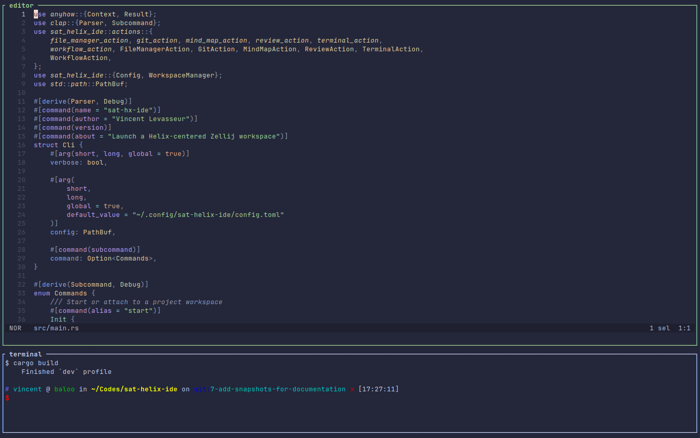
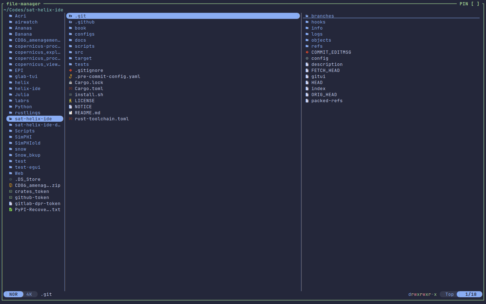
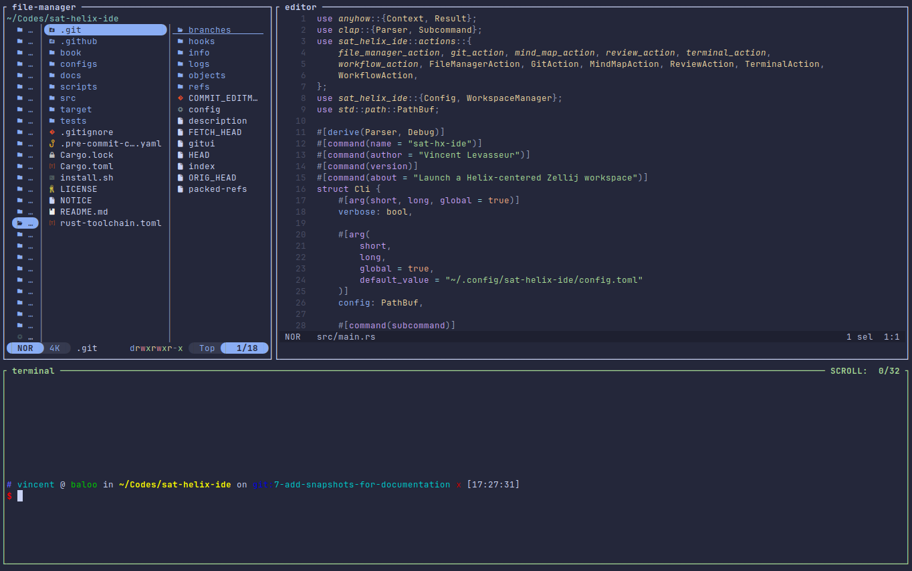
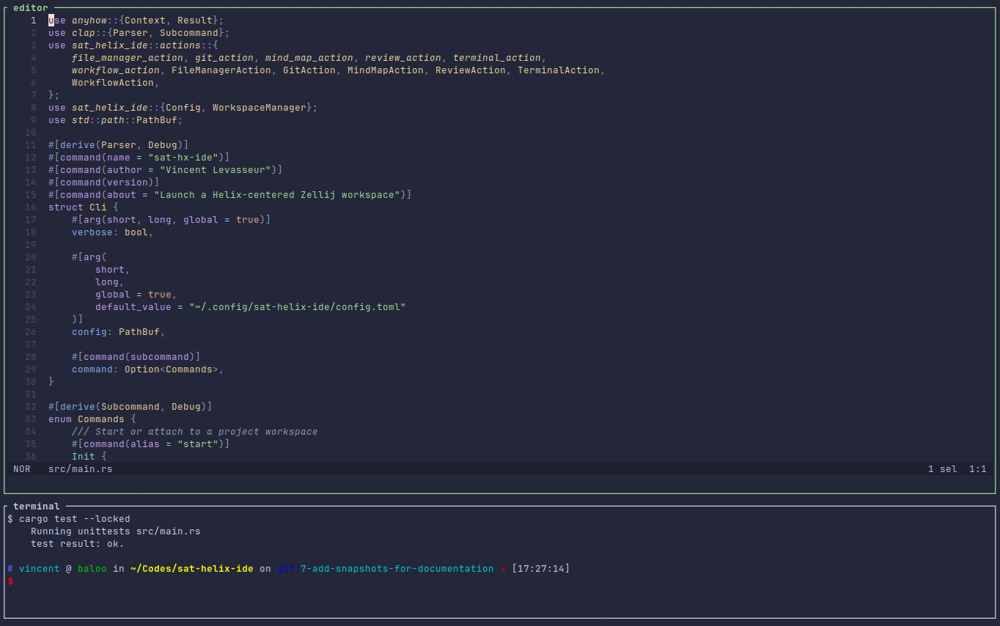
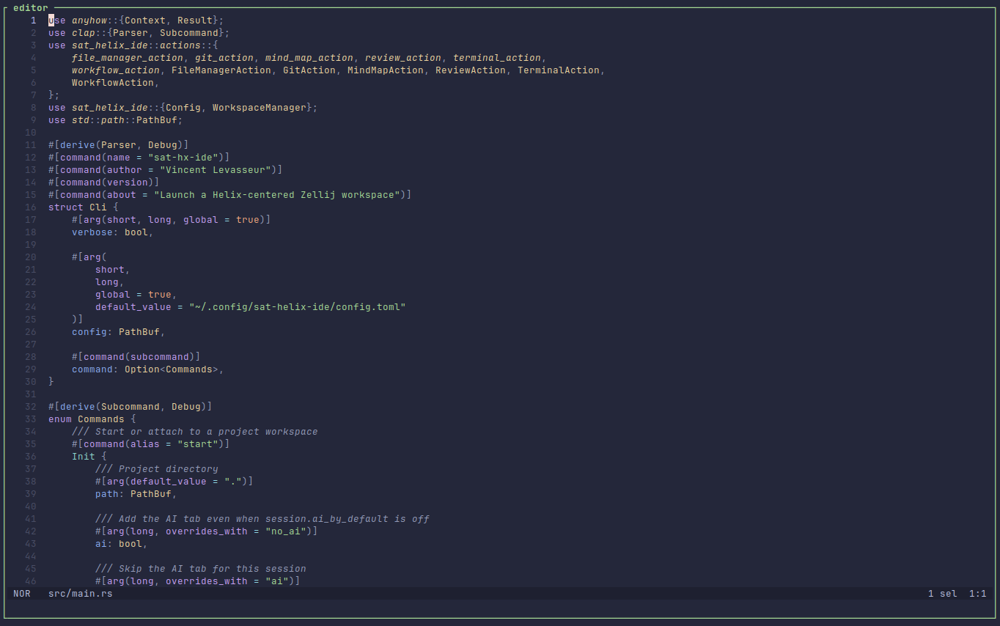
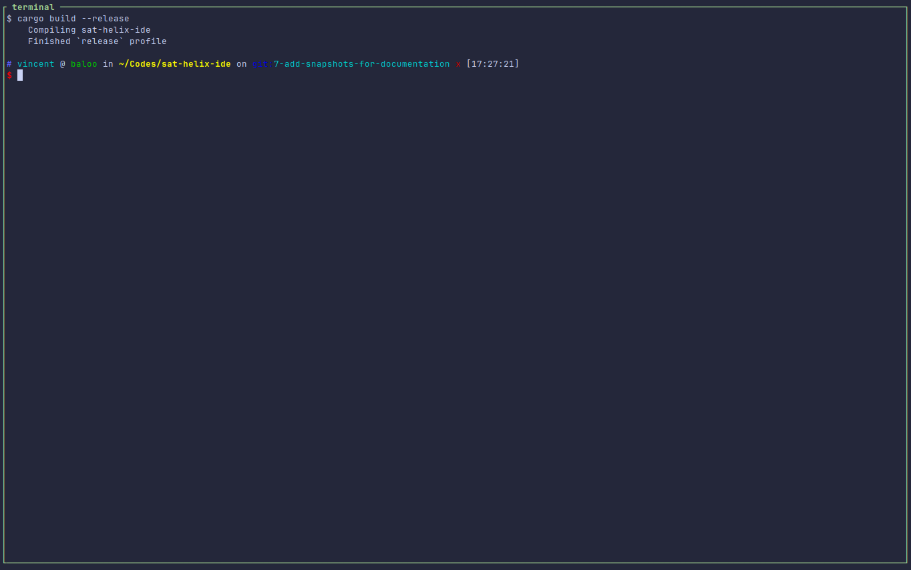
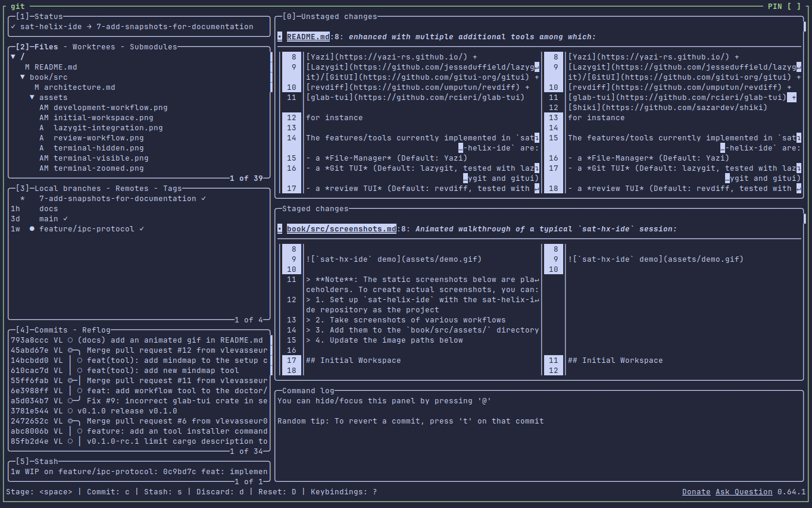
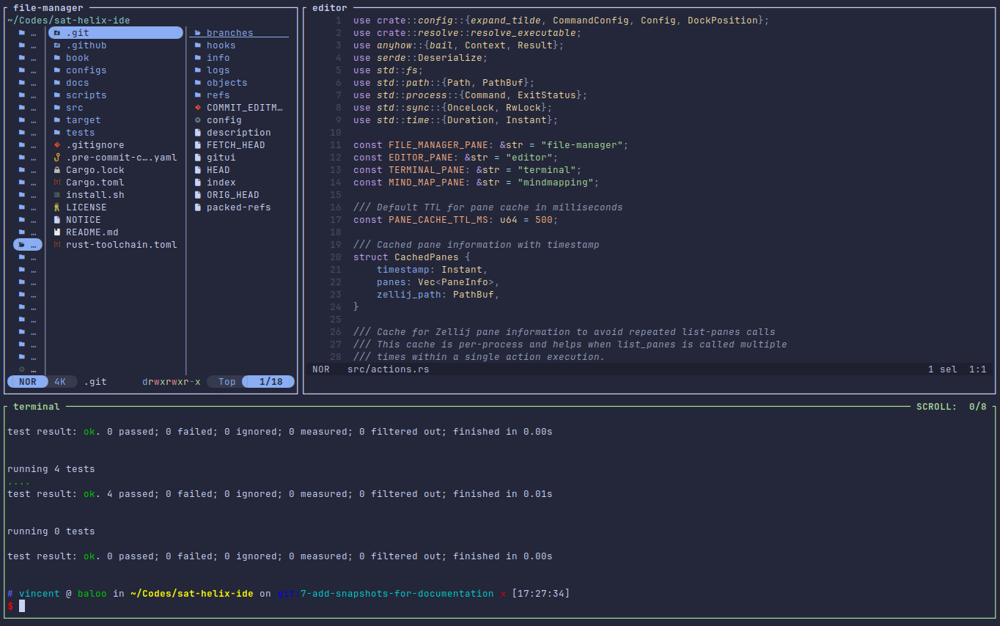
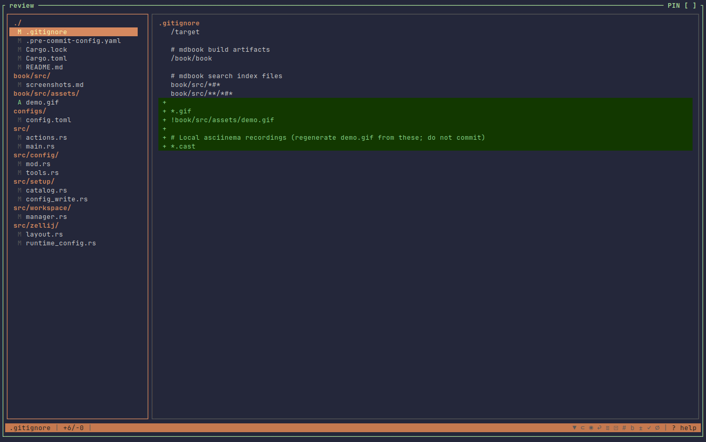

# Screenshots

This chapter contains screenshots demonstrating `sat-helix-ide` in action, specifically showing the tool being used to edit its own project.

## Demo

Animated walkthrough of a typical `sat-hx-ide` session:


## Initial Workspace

When you first launch `sat-helix-ide init .` in the sat-helix-ide repository, you'll see the default workspace:

```text
┌─────────────────────────────────────────────────────────────────────┐
│  sat-helix-ide (Zellij)                                       [ code* ] [ ai ] │
├─────────────────────────────────────────────────────────────────────┤
│                                                                         │
│  ┌─────────────────────────────────────────────────────────────────┐ │
│  │  src/  configs/  docs/  Cargo.toml  README.md  .github/           │ │
│  │  █                                                               │ │
│  │  ┌─────────────────────────────────────────────────────────────┐ │ │
│  │  │ // sat-helix-ide main.rs                                    │ │ │
│  │  │ use anyhow::{Context, Result};                              │ │ │
│  │  │ use clap::{Parser, Subcommand};                              │ │ │
│  │  │                                                                 │ │ │
│  │  │ pub mod actions;                                              │ │ │
│  │  │ pub mod config;                                               │ │ │
│  │  │ pub mod layout;                                               │ │ │
│  │  │                                                                 │ │ │
│  │  └─────────────────────────────────────────────────────────────┘ │ │
│  │                                                                     │ │
│  └─────────────────────────────────────────────────────────────────┘ │
│  ┌─────────────────────────────────────────────────────────────────┤ │
│  │ $ cargo build                                                      │ │
│  │     Compiling sat-helix-ide v0.1.0 (/home/user/Codes/sat-helix-ide)│ │
│  │     Finished `dev` profile [unoptimized + debuginfo] target(s) in 2.34s│ │
│  └─────────────────────────────────────────────────────────────────┘ │
└─────────────────────────────────────────────────────────────────────┘
```



*Caption: Default workspace with Helix editor showing the project and terminal below*

## File Manager in Action

### Opening Yazi with Ctrl-y

```text
┌─────────────────────────────────────────────────────────────────────┐
│  sat-helix-ide (Zellij)                                               [ code ] [ ai ] │
├─────────────────────────────────────────────────────────────────────┤
│  ┌─────────────────────────────────────────────────────────────────┐ │
│  │  ╭─────────────────────────────────────────────────────────────╮  │ │
│  │  │  YAZI - File Manager                                            │  │ │
│  │  │  ┌─────────────────────────────────────────────────────────┐  │ │
│  │  │  │ 📁 sat-helix-ide                                             │  │ │
│  │  │  │   ├── 📁 src/                                                 │  │ │
│  │  │  │   │   ├── 📄 main.rs                                        │  │ │
│  │  │  │   │   ├── 📄 actions.rs                                      │  │ │
│  │  │  │   │   ├── 📄 config.rs                                       │  │ │
│  │  │  │   │   └── 📄 layout.rs                                       │  │ │
│  │  │  │   ├── 📁 configs/                                            │  │ │
│  │  │  │   │   └── 📄 config.toml                                     │  │ │
│  │  │  │   ├── 📁 docs/                                               │  │ │
│  │  │  │   │   └── 📄 architecture.md                                 │  │ │
│  │  │  │   ├── 📄 Cargo.toml                                         │  │ │
│  │  │  │   ├── 📄 README.md                                           │  │ │
│  │  │  │   └── 📄 LICENSE                                             │  │ │
│  │  │  │  ──┘                                                         │  │ │
│  │  │  │  Preview: main.rs                                            │  │ │
│  │  │  │  ┌─────────────────────────────────────────────────────┐  │ │
│  │  │  │  │ use anyhow::{Context, Result};                          │  │ │
│  │  │  │  │ use clap::{Parser, Subcommand};                          │  │ │
│  │  │  │  │                                                           │  │ │
│  │  │  │  │ fn main() -> Result<()> {                                │  │ │
│  │  │  │  │     let cli = Cli::parse();                              │  │ │
│  │  │  │  └─────────────────────────────────────────────────────┘  │ │
│  │  │  └─────────────────────────────────────────────────────────┘  │ │
│  │  ╰─────────────────────────────────────────────────────────────╯  │ │
│  └─────────────────────────────────────────────────────────────────┘ │
└─────────────────────────────────────────────────────────────────────┘
```



*Caption: Yazi file manager opened in full-screen floating pane*

### Docked File Manager with Alt-y

```text
┌─────────────────────────────────────────────────────────────────────┐
│  sat-helix-ide (Zellij)                                               [ code ] [ ai ] │
├─────────────────────────────────────────────────────────────────────┤
│  ┌──────────────────┬─────────────────────────────────────────────┐ │
│  │                  │                                                 │ │
│  │  📁 sat-helix-ide │  ┌─────────────────────────────────────────┐ │ │
│  │  ├── 📁 src/      │  │ // Editing actions.rs                              │ │ │
│  │  │   ├── main.rs │  │ use anyhow::{Context, Result};                    │ │ │
│  │  │   █ actions.rs│  │ pub mod actions {                                 │ │ │
│  │  │   config.rs  │  │     use crate::config::Config;                      │ │ │
│  │  │   layout.rs  │  │     use zellij_tile::prelude::*;                   │ │ │
│  │  │              │  │ }                                                   │ │ │
│  │  ├── 📁 configs/ │  │                                                 │ │ │
│  │  │   └── config │  │                                                 │ │ │
│  │  ├── 📁 docs/    │  │                                                 │ │ │
│  │  └── README.md  │  └─────────────────────────────────────────┘ │ │
│  │                  │                                                     │ │
│  └──────────────────┴─────────────────────────────────────────────┘ │
│  ┌─────────────────────────────────────────────────────────────────┤ │
│  │ $ git status                                                     │ │
│  └─────────────────────────────────────────────────────────────────┘ │
└─────────────────────────────────────────────────────────────────────┘
```



*Caption: Yazi docked to the left of Helix, allowing simultaneous file browsing and editing*

## Terminal Toggle

### Terminal Visible (Default)

```text
┌─────────────────────────────────────────────────────────────────────┐
│  sat-helix-ide (Zellij)                                               [ code ] [ ai ] │
├─────────────────────────────────────────────────────────────────────┤
│  ┌─────────────────────────────────────────────────────────────────┐ │
│  │  // Editing main.rs                                                │ │
│  │  use anyhow::{Context, Result};                                   │ │
│  │  use clap::{Parser, Subcommand};                                   │ │
│  │                                                                     │ │
│  │  fn main() -> Result<()> {                                         │ │
│  │      let cli = Cli::parse();                                       │ │
│  │      cli.command.execute()?;                                      │ │
│  │  }                                                                 │ │
│  └─────────────────────────────────────────────────────────────────┤ │
│  ┌─────────────────────────────────────────────────────────────────┐ │
│  │ $ cargo test                                                       │ │
│  │     Running unittests src/main.rs (target/debug/deps/sat...   │ │
│  │     test result: ok. 1 passed; 0 failed; 0 ignored                │ │
│  └─────────────────────────────────────────────────────────────────┘ │
└─────────────────────────────────────────────────────────────────────┘
```



### Terminal Hidden (Alt-t)

```text
┌─────────────────────────────────────────────────────────────────────┐
│  sat-helix-ide (Zellij)                                               [ code ] [ ai ] │
├─────────────────────────────────────────────────────────────────────┤
│  ┌─────────────────────────────────────────────────────────────────┐ │
│  │  // Editing main.rs                                                │ │
│  │  use anyhow::{Context, Result};                                   │ │
│  │  use clap::{Parser, Subcommand};                                   │ │
│  │                                                                     │ │
│  │  fn main() -> Result<()> {                                         │ │
│  │      let cli = Cli::parse();                                       │ │
│  │      cli.command.execute()?;                                      │ │
│  │                                                                     │ │
│  │  // More code...                                                   │ │
│  │                                                                     │ │
│  │                                                                     │ │
│  └─────────────────────────────────────────────────────────────────┘ │
│  ┌─────────────────────────────────────────────────────────────────┤ │
│  │ Terminal is hidden - Press Alt-t to show                           │ │
│  └─────────────────────────────────────────────────────────────────┘ │
└─────────────────────────────────────────────────────────────────────┘
```



*Caption: Terminal hidden, giving Helix full editing space (Alt-t to show again)*

### Terminal Zoomed (Alt-Shift-t)

```text
┌─────────────────────────────────────────────────────────────────────┐
│  sat-helix-ide (Zellij)                                               [ code ] [ ai ] │
├─────────────────────────────────────────────────────────────────────┤
│  ┌─────────────────────────────────────────────────────────────────┐ │
│  │ $ cargo build --release                                            │ │
│  │     Compiling sat-helix-ide v0.1.0                                │ │
│  │     (release build)                                               │ │
│  │     Finished `release` profile [optimized] target(s) in 25.69s     │ │
│  │                                                                     │ │
│  │ $ ./target/release/sat-hx-ide --version                           │ │
│  │ sat-hx-ide 0.1.0                                                  │ │
│  │                                                                     │ │
│  │ $                                                                │ │
│  └─────────────────────────────────────────────────────────────────┘ │
└─────────────────────────────────────────────────────────────────────┘
```



*Caption: Terminal zoomed to full tab height for complex commands (Alt-Shift-t to dock back)*

## Git TUI Integration

### Opening Lazygit with Alt-g

```text
┌─────────────────────────────────────────────────────────────────────┐
│  sat-helix-ide (Zellij)                                               [ code ] [ ai ] │
├─────────────────────────────────────────────────────────────────────┤
│  ┌─────────────────────────────────────────────────────────────────┐ │
│  │  ┌─────────────────────────────────────────────────────────────┐ │ │
│  │  │  Lazygit - sat-helix-ide                                        │ │ │
│  │  │  ┌─────────────────────────────────────────────────────────┐ │ │ │
│  │  │  │ Files                                                      │ │ │ │
│  │  │  │ █ M src/main.rs                                            │ │ │ │
│  │  │  │ █ M src/actions.rs                                          │ │ │ │
│  │  │  │    README.md                                                │ │ │ │
│  │  │  │    LICENSE                                                  │ │ │ │
│  │  │  │                                                             │ │ │ │
│  │  │  │ Local Changes                                               │ │ │ │
│  │  │  │ 2 files changed                                             │ │ │ │
│  │  │  │                                                             │ │ │ │
│  │  │  │ Press 's' to stage, 'c' to commit, 'p' to push              │ │ │ │
│  │  │  └─────────────────────────────────────────────────────────┘ │ │ │
│  │  └─────────────────────────────────────────────────────────────┘ │ │
│  └─────────────────────────────────────────────────────────────────┘ │
│  ┌─────────────────────────────────────────────────────────────────┤ │
│  │ Helix editor (paused)                                              │ │
│  └─────────────────────────────────────────────────────────────────┘ │
└─────────────────────────────────────────────────────────────────────┘
```



*Caption: Lazygit opened in a floating pane, showing repository status and local changes*

## Editing sat-helix-ide Itself

### Multi-Pane Development Workflow

This screenshot shows the typical workflow when developing `sat-helix-ide` itself:

```text
┌─────────────────────────────────────────────────────────────────────┐
│  sat-helix-ide Development                                        [ code* ] [ ai ] │
├─────────────────────────────────────────────────────────────────────┤
│  ┌──────────────┬─────────────────────────────────────────────────┐ │
│  │              │                                                 │ │
│  │  📁 src/      │  // Editing actions.rs                               │ │
│  │  ├── main.rs │  pub fn handle_file_manager_open(                   │ │
│  │  █ actions.rs│      pane_name: &str,                                 │ │
│  │  config.rs  │      panes: &[PaneInfo],                             │ │
│  │  layout.rs  │      config: &Config,                                │ │
│  │             │  ) -> Result<()> {                                   │ │
│  │  📁 tests/   │      // Implementation details...                    │ │
│  │  └── test_  │  }                                                   │ │
│  │              │                                                     │ │
│  │              │  // More editing...                                  │ │
│  │              │                                                     │ │
│  └──────────────┴─────────────────────────────────────────────────┘ │
├─────────────────────────────────────────────────────────────────────┤
│  $ cargo test --locked                                                  │
│      Compiling sat-helix-ide v0.1.0 (/home/user/Codes/sat-helix-ide)   │
│      Finished `test` profile [unoptimized + debuginfo] target(s) in 5.42s│
│      Running unittests src/main.rs (target/debug/deps/sat...          │
│      test result: ok. 12 passed; 0 failed; 0 ignored; 0 measured       │
│      Running tests/test_actions.rs (target/debug/deps/tests...          │
│      test result: ok. 8 passed; 0 failed; 0 ignored; 0 measured        │
│      Doc-tests sat-helix-ide                                             │
│      test result: ok. 0 passed; 0 failed; 0 ignored; 0 measured        │
└─────────────────────────────────────────────────────────────────────┘
```



*Caption: Full development workflow: Yazi docked for file navigation, Helix for editing, terminal for running tests*

### Reviewing Changes with Alt-r

```text
┌─────────────────────────────────────────────────────────────────────┐
│  sat-helix-ide Development                                        [ code ] [ ai ] │
├─────────────────────────────────────────────────────────────────────┤
│  ┌─────────────────────────────────────────────────────────────────┐ │
│  │  ┌─────────────────────────────────────────────────────────────┐ │ │
│  │  │  revdiff - Review Changes                                       │ │ │
│  │  │  ┌─────────────────────────────────────────────────────────┐ │ │ │
│  │  │  │ Commit: feat: add workflow tool support                    │ │ │ │
│  │  │  │                                                             │ │ │ │
│  │  │  │ diff --git a/src/actions.rs b/src/actions.rs               │ │ │ │
│  │  │  │ index abc123..def456 100644                                  │ │ │ │
│  │  │  │ +++ b/src/actions.rs                                         │ │ │ │
│  │  │  │ @@ -100,6 +100,12 @@                                          │ │ │ │
│  │  │  │  pub fn handle_workflow_open(                               │ │ │ │
│  │  │  │ +    pane_name: &str,                                        │ │ │ │
│  │  │  │ +    panes: &[PaneInfo],                                    │ │ │ │
│  │  │  │ +    config: &Config,                                       │ │ │ │
│  │  │  │ +) -> Result<()> {                                          │ │ │ │
│  │  │  │ +    // New workflow implementation...                       │ │ │ │
│  │  │  │ +}                                                          │ │ │ │
│  │  │  │                                                             │ │ │ │
│  │  │  │ [1/3] Showing commit 1 of 3                                  │ │ │ │
│  │  │  └─────────────────────────────────────────────────────────┘ │ │ │
│  │  └─────────────────────────────────────────────────────────────┘ │ │
│  └─────────────────────────────────────────────────────────────────┘ │
│  ┌─────────────────────────────────────────────────────────────────┤ │
│  │ // Editing continues in Helix...                                   │ │
│  └─────────────────────────────────────────────────────────────────┘ │
└─────────────────────────────────────────────────────────────────────┘
```



*Caption: Reviewing code changes with revdiff in a floating pane while continuing to edit*

## Creating Your Own Screenshots

Regenerate the PNGs under `book/src/assets/` with the capture script (requires
`xvfb`, `xterm` with `xterm-direct` terminfo, `xdotool`, `xrdb`, ImageMagick
`import`, and a Nerd Font such as **JetBrainsMono Nerd Font Mono** for Yazi
icons). Screenshots use **Catppuccin Macchiato** via `scripts/screenshot-theme/`,
and force `TERM=xterm-direct` + `COLORTERM=truecolor` so Helix gets 24-bit
colors (plain `TERM=xterm` is only 8 colors and makes blues nearly invisible):

```bash
bash scripts/capture-screenshots.sh
```

The script starts a headless Zellij session, drives each UI state via
`sat-hx-ide` / `zellij` actions, and writes:

1. `initial-workspace.png` — default Helix + terminal layout
2. `yazi-fullscreen.png` — Yazi floating (`Ctrl-y`)
3. `yazi-docked.png` — Yazi docked (`Alt-y`)
4. `terminal-visible.png` — default terminal dock
5. `terminal-hidden.png` — terminal hidden (`Alt-t`)
6. `terminal-zoomed.png` — terminal zoomed (`Alt-Shift-t`)
7. `lazygit-integration.png` — Lazygit floating (`Alt-g`)
8. `development-workflow.png` — docked Yazi + Helix + tests
9. `review-workflow.png` — revdiff floating (`Alt-r`)

### Tips for Good Screenshots

- Use a clean, readable font (Fira Code, JetBrains Mono, etc.)
- Ensure good contrast (light background with dark text or vice versa)
- Show realistic content (actual code from the project)
- Keep the terminal at a reasonable size for readability
- Maintain consistent styling across all screenshots

## Next Steps

- [Configuration](./configuration.md) - Learn how to customize your setup
- [Architecture](./architecture.md) - Understand the design and implementation
