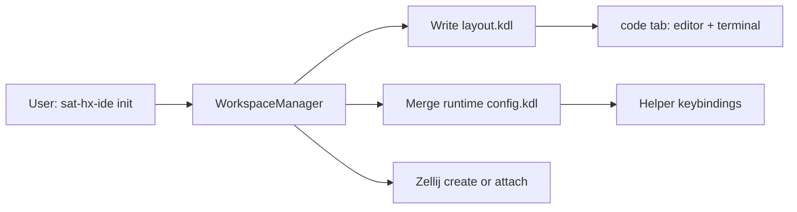

# sat-hx-ide architecture (process model)

sat-hx-ide composes a Zellij workspace for a Helix-centered IDE workflow. Each
keybinding spawns a short-lived `sat-hx-ide` helper process that drives Zellij
CLI actions and exits. There is no background daemon.

## Session init

1. Resolve the project directory and session name.
2. Write `layout.kdl` (editor, optional docked terminal, optional AI tab).
3. Merge keybindings into a private copy of the user's Zellij config.
4. Create or attach the Zellij session.

Runtime files live under `$XDG_RUNTIME_DIR/sat-helix-ide/<session>/`.

## Helper commands

Zellij bindings invoke hidden subcommands on the `sat-hx-ide` binary:

| Key (default) | Command | Action |
|---------------|---------|--------|
| Ctrl-y | `__file-manager open` | Open/focus Yazi |
| Alt-y | `__file-manager toggle-dock` | Float or dock file manager |
| Alt-t | `__terminal toggle` | Hide/show terminal via fullscreen |
| Alt-Shift-t | `__terminal zoom` | Zoom terminal or dock back |
| Alt-g | `__git open` | Spawn configured Git TUI in floating pane |
| Alt-r | `__review open` | Spawn configured review tool in floating pane (default: revdiff) |

Helpers run in tiny floating panes (`close_on_exit true`) so Zellij keeps the
keybinding helper's TTY for actions that need it (file-manager spawn).

## Action routing

All logic lives in [`src/actions.rs`](../src/actions.rs):

- **File manager** — If a `file-manager` pane exists, focus it; otherwise rename
  the helper pane and run Yazi in-process (chooser loop, open in Helix).
- **Terminal** — Toggle fullscreen on editor/terminal panes; respawn terminal
  with layout-aware direction when the shell pane was closed.
- **Git** — Spawn a floating pane on the code tab with the resolved Git client.
- **Review** — Spawn a floating pane with the tool from `[tools.review]` (default `revdiff`).

## Pane cache

Within one helper invocation, `list-panes` results are cached for 500 ms to avoid
 repeated Zellij queries during multi-step actions. Resize loops bypass the cache
 (`fetch_panes`) so geometry stays fresh. The cache is invalidated after terminal
 respawn.

## Terminal layout

`[terminal]` in config controls the docked shell in the code tab:

- `enabled` — include terminal pane in layout
- `dock_percent` — size as % of the split
- `dock_position` — `down` (horizontal split, default) or `right` (vertical split)

Respawn uses the same direction and resizes against the editor pane.

## Configuration merge

sat-hx-ide never edits the user's global Zellij config. It reads the source
(read-only), checks for key collisions, injects bindings under
`shared_except "locked"`, and writes a session-specific runtime copy passed to
Zellij via `--config`.

## Related docs

- [README](../README.md) — usage and requirements
- IPC daemon experiment (not merged): see `feature/ipc-protocol` branch
